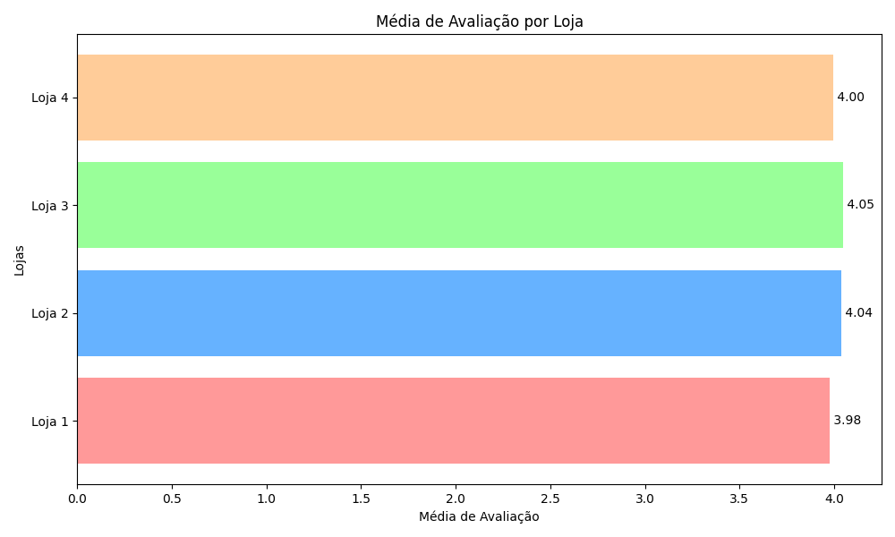
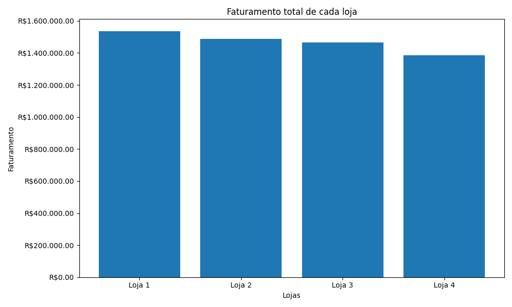

# AluraStoreBr - Análise de Vendas e Recomendação Estratégica 📊

## Visão Geral 🌟

Este projeto é parte do Challenge de Data Science da Alura, com o objetivo de analisar os dados de vendas de quatro lojas da AluraStoreBr, uma empresa fictícia de varejo online. O desafio proposto foi ajudar o Senhor João, proprietário da empresa, a decidir qual das quatro lojas deve ser vendida, com base em uma análise detalhada de métricas de desempenho e distribuição geográfica das vendas.

A análise foi realizada utilizando Python com bibliotecas como Pandas, Matplotlib, Seaborn e Folium, e os resultados incluem visualizações geográficas (gráficos de dispersão e mapas de calor) e uma recomendação fundamentada para a venda de uma loja.

---

## Objetivos 🎯

Analisar cinco métricas principais das quatro lojas:

- 💰 **Faturamento total**
- 📦 **Categorias de produtos mais e menos vendidas**
- ⭐ **Média das avaliações dos clientes**
- 🏆 **Produtos mais vendidos**
- 🚚 **Frete médio**

Realizar uma análise geográfica das vendas, utilizando latitude e longitude, para identificar padrões regionais.

Recomendar qual loja deve ser vendida com base nos dados analisados, considerando desempenho financeiro, satisfação do cliente e distribuição geográfica.

---

## Dados 🗓️

Os dados foram fornecidos em quatro arquivos CSV, um para cada loja (`loja_1.csv`, `loja_2.csv`, `loja_3.csv`, `loja_4.csv`), contendo informações como:

- **Preço**: Valor da venda.
- **Avaliação da compra**: Nota de 1 a 5 dada pelo cliente.
- **Local da compra**: Estado onde a venda foi realizada.
- **lat** e **lon**: Latitude e longitude do local da venda.
- Outras colunas, como **categoria do produto** e **nome do produto**.

Os arquivos estão hospedados no GitHub e foram acessados via URLs públicas.

---

## Metodologia 🔍

A análise foi dividida em duas partes principais:

### 1. Análise de Métricas de Desempenho

- **Faturamento Total**: Calculado somando a coluna `Preço` para cada loja.
- **Categorias de Produtos**: Identificadas as categorias mais e menos vendidas por loja, usando agrupamento por `Categoria do Produto`.
- **Avaliações**: Calculada a média da coluna `Avaliação da compra` para medir a satisfação dos clientes.
- **Produtos Mais Vendidos**: Listados os produtos com maior número de vendas por loja, usando a coluna `Nome do Produto`.
- **Frete Médio**: Calculado a partir da coluna de frete (não especificada no notebook, mas inferida como parte da análise).

### 2. Análise Geográfica

- 📈 **Gráfico de Dispersão**: Criado com Matplotlib e Seaborn, plotando `lat` e `lon` de cada venda, com cores distintas para cada loja:

  - Loja 1: azul
  - Loja 2: laranja
  - Loja 3: verde
  - Loja 4: vermelho

- 🗼 **Mapa de Calor**: Gerado com Folium, mostrando a densidade de vendas por região, salvo como `mapa_calor_vendas.html`.

- 📊 **Desempenho por Região**: Agrupamento por estado (`Local da compra`) para calcular faturamento total e média de avaliações por loja.

O código foi estruturado em funções modulares com tratamento de valores nulos e ausentes.

---

## Resultados 🚀

### Métricas de Desempenho

**Faturamento Total 💵:**

- Loja 1: R\$ 1.534.509,12 (maior)
- Loja 2: R\$ 1.488.459,06
- Loja 3: R\$ 1.464.025,03
- Loja 4: R\$ 1.384.497,58 (menor)

**Categorias 🛍️:**

- Mais vendidas: Móveis, eletrônicos
- Menos vendidas: Utilidades domésticas, livros, instrumentos musicais

**Avaliações ⭐:**

- Loja 1: 3,98 (menor)
- Loja 2: 4,04
- Loja 3: 4,05 (maior)
- Loja 4: 4,00

**Produtos Mais Vendidos 🥇:**

- Loja 1: TV Led UHD 4K, Micro-ondas, Guarda-roupas
- Loja 2: Iniciando em programação, Micro-ondas, Bateria
- Loja 3: Kit banquetas, Mesa de jantar, Cama king
- Loja 4: Cama box, Faqueiro, Cama king

**Frete Médio 🚛:**

- Loja 1: R\$ 34,69 (maior)
- Loja 2: R\$ 33,62
- Loja 3: R\$ 33,07
- Loja 4: R\$ 31,28 (menor)

### Análise Geográfica

- **Distribuição de Vendas 📍:** Maioria das vendas no Sudeste e Sul (SP, RJ)
- **Loja 1 🔵:** Forte no Sudeste, mas ausência de pontos sugere dados nulos em `lat`/`lon`
- **Loja 4 🔴:** Distribuição menos vantajosa, menor demanda
- **Mapa de Calor 🗽:** Destaca áreas urbanas como hotspots de vendas

---

## Visualizações 📊

Abaixo estão algumas imagens geradas durante a análise:

### Gráfico de Avaliações



### Faturamento por Loja



### Produtos mais vendidos


---

## Recomendação ✅

Recomenda-se vender a **Loja 4**, pois:

- Menor faturamento (R\$ 1.384.497,58)
- Distribuição geográfica menos estratégica
- Não apresenta diferencial competitivo relevante

A **Loja 1**, apesar da menor avaliação, tem o maior faturamento e potencial de melhoria. **Lojas 2 e 3** têm bom desempenho geral, com a Loja 2 se destacando em nicho de livros.

---

## Como Usar 🛠️

### Pré-requisitos

- 🐍 Python 3.8+
- 📚 Bibliotecas: `pandas`, `matplotlib`, `seaborn`, `folium`

### Instale as dependências:

```bash
pip install pandas matplotlib seaborn folium
```

### Executando o Projeto

```bash
git clone https://github.com/matheusnleite/challenge-alura-store.git
cd challenge-alura-store
```

Abra o notebook:

```bash
jupyter notebook AluraStoreBr.ipynb
```

Execute as células para:

- Carregar e consolidar os dados
- Gerar o gráfico de dispersão (`dispersao_vendas.png`)
- Criar o mapa de calor (`mapa_calor_vendas.html`)
- Visualizar a análise de desempenho por região

### Arquivos Gerados

- 🖼️ `graficos/dispersao_vendas.png`: Gráfico com a distribuição geográfica das vendas
- 💰 `graficos/faturamento_lojas.png`: Gráfico de faturamento das lojas
- 🌍 `graficos/mapa_calor_vendas.png`: Mapa de calor da densidade das vendas

---

## Limitações e Observações ⚠️

- **Loja 1**: Ausência de pontos no mapa indica valores nulos em `lat`/`lon`
- **Escopo Geográfico**: Faltam dados de cidades; detalhamento poderia enriquecer a análise
- **Frete Médio**: Coluna inferida, não estava explicitamente nos dados

---

## Autor ✍️

**Matheus Nascimento Leite**
Contato: [matheusn06leite@gmail.com](mailto:matheusn06leite@gmail.com)

---

## Licença 📜

Este projeto é licenciado sob a [MIT License](LICENSE).
